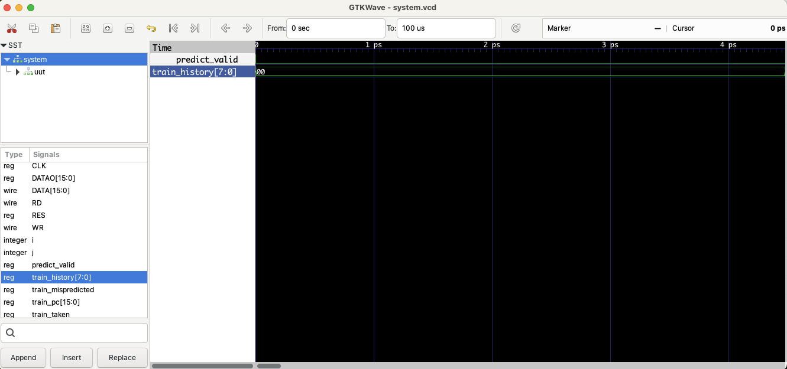

# u[Dark]RISC (modified) with Branch Prediction -- Enhanced micro-DarkRISC

This is an enhanced version of the 16-bit RISC processor originally designed years before DarkRISCV. This version includes a gshare branch predictor to improve performance on branch-heavy code. While still maintaining the simplicity and educational value of the original design, this version demonstrates how modern branch prediction techniques can be integrated into a simple processor core.
Implemeted branch prediction and history implemented but waveform looks like not working.

# Features

Enhanced from the original 2015 design, it includes:

- Two state pipelined RISC
- Flexible 16x16-bit registers
- 16-bit Program Counter (PC)
- Harvard Architecture w/ separate ROM/RAM up to 64Kword each - Memory mapped IO
- **Gshare branch predictor with 256-entry pattern history table**
- **Two-bit saturating counters for branch prediction**
- **Global branch history register for improved prediction accuracy**
- Modular design with separate branch predictor module
- Can be easily extended or modified!

# History & Motivation

The beginning: 16-bit VLIW DSPs on FPGAs, with high optimized ALUs around DSP blocks (18x18 mul w/ 48-bit accumulators), in a way that multiple MAC operations can be optimized in parallel w/ other operations (load, branch, etc). However, conventional code was hard to port for VLIW DSPs, so a more general purpose processor was needed...

Lots of different concepts around accumulator-oriented, register bank oriented, parallel data/address, VLIW, SIMD, MIMD, vector, 16/24/32/48-bits, etc most designs were identified just as "core" or "dsp", but this specific concept was named uRISC for an external presentation on a University. Because there are too much processors called uRISC already, it was renamed to uDarkRISC (micro-DarkRISC).

Designed as a evaluation processor, it was never designed to be used on real products and never tested with complex applications... however, the more conventional approach was used as base for DarkRISCV, a high-performance processor which implements a RV32I/E 100% compatible with GCC compiler! For more information about DarkRISCV, please check: https://github.com/darklife/darkriscv/tree/master

This enhanced version with branch prediction demonstrates how modern processor features can be added to the simple core while maintaining its educational value.

# Branch Prediction (problem153 of VerilogEval)

The processor now includes a gshare branch predictor, which significantly improves performance on branch-heavy code. The branch predictor features:

- An 8-bit global branch history register (BHR) that tracks the outcomes of recent branches
- A 256-entry pattern history table (PHT) of 2-bit saturating counters
- XOR hashing of PC and branch history to index into the PHT
- Prediction and training interfaces for accurate branch prediction

The branch predictor works by:
1. During instruction fetch, the current PC is XORed with the branch history register to index into the pattern history table
2. The 2-bit counter at that index determines whether the branch is predicted taken or not taken
3. When a branch is executed, the branch predictor is trained with the actual outcome
4. If a misprediction occurs, the branch history register is recovered to the correct state

This approach allows the processor to achieve much better performance on code with loops and conditional branches, as it can predict branch outcomes with increasing accuracy over time.

# Instruction Decode

The 16bit instruction word is read from the synchronous BRAM and divided in 3 or 4 fields, depending on the instruction type:

- bits 15:12 are the instruction opcode
- bits 11:8 are the destination register (DREG)
- bits 7:4 are the source register (SREG)
- bits 3:0 are reserved for instruction options

Alternatively, the field 7:0 can be used to load a signed extended 8-bit constant.

# Instruction Execution

According to the Destination Register, Source Register, Option Data or Immediate Data, all 16 possible instructions are computed in parallel and put in a 16x16-bit array:

- shift SREG>>>OPTS ROR)
- shift SREG<<<OPTS (ROL)
- add DREG+OPTS or DREG+SREG (ADD)
- sub DREG-OPTS or DREG-SREG (SUB)
- xor DREG^SREG (XOR)
- and DREG&SREG (AND)
- or DREG|SREG (OR)
- not ~DREG (NOT)
- load (LOD) 
- store (STO)
- immediate (IMM)
- (DREG*SREG)>>>OPTS (MUL)
- branch (BRA)
- branch to sub-routine (BSR)
- return from sub-routine (RET)
- test, decrement and branch (LOP)

Note that there is no conditional branches other than the LOP instruction.

As far as the instructions are read from the ROM, the opcode is used to index the above array, so the result is written directly to the register bank. Also, the PC is computed, in a way that it can be 0 (RES==0), DREG (RET instruction), PC+IMM (BSR, BRA or LOP instructions) or just PC+1.

Finnaly, the LOD and STO activate the RD and WR signals for load/store, with DATA active w/ DREG on store or tri-state on load and SREG as pointer in both cases (so, no addressing modes).

# Pipeline Detail

The micro-DarkRISC is a high performance processor that needs a lot of bandwidth on the instruction bus: running at 75MHz, it requires 150MB/s continuously! The pipeline is optimized to be always filled, even in the case of a branch.

With the addition of branch prediction, the processor can now speculatively execute instructions following a branch, significantly improving performance on branch-heavy code. When a branch is encountered:

1. The branch predictor predicts whether the branch will be taken or not
2. The processor fetches the next instruction from either the branch target (if predicted taken) or the sequential address (if predicted not taken)
3. If the prediction is correct, execution continues without interruption
4. If the prediction is incorrect, the processor recovers by fetching from the correct address and training the branch predictor

This approach allows the processor to maintain high instruction throughput even with frequent branches.

Since the load/store instructions are not used so often, there is no optimization regarding the load/store. The impact of such decision depends on the application: for applications that are handled only with internal registers, there is no impact. For most cases, however, a small LUTRAM may be enough and, again there is no impact. 

Eventually, in the case of BRAM, wait-states are required, but the core does not foresee a HALT signal, so there is no way to insert wait-states. Instead, it is possible simulate such wait-states by successive load/store instructions at the same address, so the memory is read multiple times until it is ready.

# Instruction Set

The direct supported instructions are:

- ROR/ROL: register right or left rotate.
- ADD/SUB: register add/sub.
- XOR/AND/OR/NOT: register logic operations.
- LOD/STO: register to/from memory operations.
- IMM: immediate data load (8-bit LSB value).
- MUL: register multiply and right rotate (trying include some DSP support, but without a wide accumulator).
- BRA/BSR: load PC from PC+immediate data and, optionally, save PC to a register.
- RET: load PC from register data.
- LOP: test register, decrement register and set PC to PC+immediate data.

In addition, there is an Advanced Instruction Set (aka "pseudo-instructions"). 

The known pseudo-instructions are:

- MOV: ROR or ROL with shift value = 0.
- NOP: MOV with same source/destination register.
- ADDQ/SUBQ: quick add/sub a value between 1 and 15.
- JMP: move the address to a register and RET from this register - INC/DEC: ADDQ/SUBQ with value 1.
- CLR: xor in the same register.
- and much more! 

Since the design was before my contact with RISC-V technology, some important concepts are just missing and the set is mostly 68k oriented: ADDQ, SUBQ, BSR, BRA, etc. Even LOP is basically a RISC version of DBcc, which is pretty useful for DSP applications, since LOP supports delayed branch. Although there is no accumulator, the theory around a large accumulator is compute sucessive MUL + ADD, in a way that the values are shifted left. Instead, on this core, the MUL result is shifted right, so it can be accumulated in a separate step, resulting in values that fits on 16-bit only and all LSBs are lost.

# Development System

Limited to an AWK-based assembler that generates a Verilog file w/ the ROM description and waveform inspection of the simulation... I like show the AWK-based assembler because I developed lots and lots of assemblers and converters across my time working on Siemens, both for well-known archs (such as convert 68000 asm to coldfire asm) and obscure and fully proprietary archs (such as multi-way VLIW DSPs), as well all kind of code/data to verilog converters.

# Conclusion

This enhanced version of uDarkRISC demonstrates how modern processor features like branch prediction can be added to a simple core while maintaining its educational value. The addition of the gshare branch predictor significantly improves performance on branch-heavy code, making the processor more suitable for a wider range of applications.

While the original uDarkRISC was designed primarily as an educational tool, this enhanced version shows how simple processors can be incrementally improved with features from modern architectures. It remains an excellent starting point for those learning processor design, while also demonstrating more advanced concepts in computer architecture.
